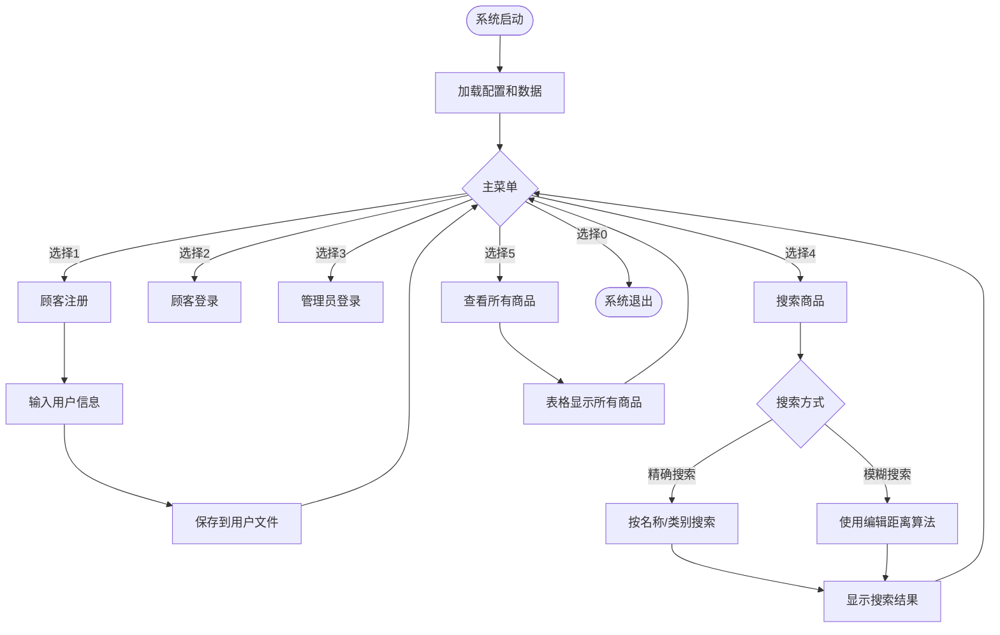
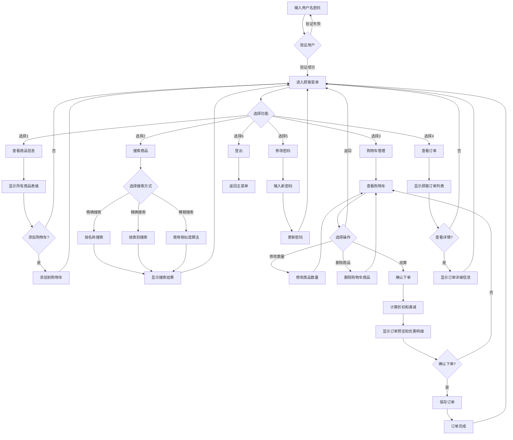
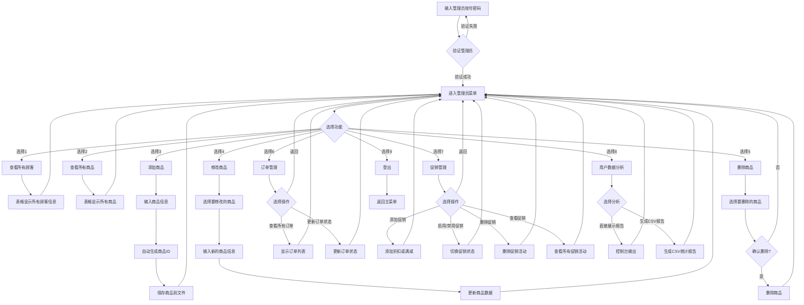
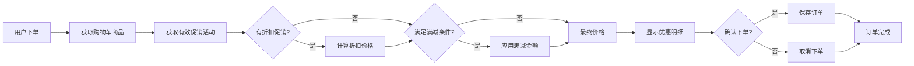
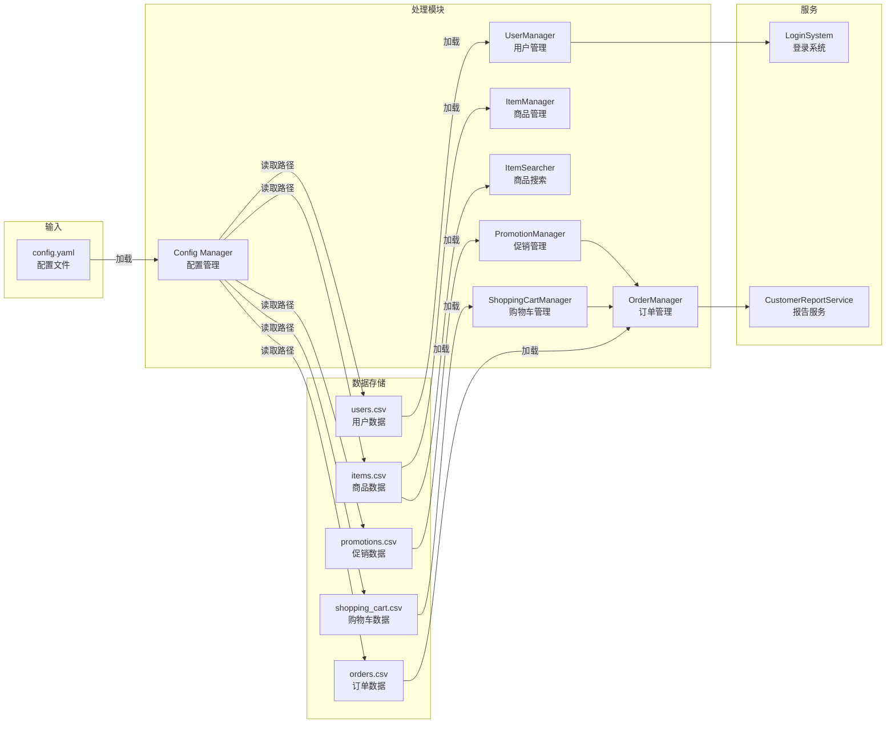

# 购物系统流程图

## 系统主流程

```mermaid
graph TD
    Start([系统启动]) --> Load[加载配置和数据]
    Load --> MainMenu{主菜单}
    
    MainMenu -->|选择1| Register[顾客注册]
    MainMenu -->|选择2| CustLogin[顾客登录]
    MainMenu -->|选择3| AdminLogin[管理员登录]
    MainMenu -->|选择4| SearchProduct[搜索商品]
    MainMenu -->|选择5| ViewAllProducts[查看所有商品]
    MainMenu -->|选择0| Exit([系统退出])
    
    Register --> RegProcess[输入用户信息]
    RegProcess --> SaveReg[保存到用户文件]
    SaveReg --> MainMenu
    
    SearchProduct --> SearchMenu{搜索方式}
    SearchMenu -->|精确搜索| ExactSearch[按名称/类别搜索]
    SearchMenu -->|模糊搜索| FuzzySearch[使用编辑距离算法]
    ExactSearch --> DisplayResult[显示搜索结果]
    FuzzySearch --> DisplayResult
    DisplayResult --> MainMenu
    
    ViewAllProducts --> DisplayAll[表格显示所有商品]
    DisplayAll --> MainMenu
```

## 顾客登录后流程

```mermaid
graph TD
    CustLogin[输入用户名密码] --> Verify{验证用户}
    Verify -->|验证失败| CustLogin
    Verify -->|验证成功| CustMenu[进入顾客菜单]
    
    CustMenu --> Choice{选择功能}
    
    Choice -->|选择1| ViewProducts[查看商品信息]
    Choice -->|选择2| SearchProd[搜索商品]
    Choice -->|选择3| ShoppingCart[购物车管理]
    Choice -->|选择4| MyOrders[查看订单]
    Choice -->|选择5| ChangePassword[修改密码]
    Choice -->|选择6| Logout[登出]
    
    ViewProducts --> DisplayItems[显示所有商品表格]
    DisplayItems --> AddCart{添加购物车?}
    AddCart -->|是| AddToCart[添加到购物车]
    AddToCart --> CustMenu
    AddCart -->|否| CustMenu
    
    SearchProd --> SearchType{选择搜索方式}
    SearchType -->|精确搜索| Search1[按名称搜索]
    SearchType -->|精确搜索| Search2[按类别搜索]
    SearchType -->|模糊搜索| Search3[使用相似度算法]
    Search1 --> ShowSearchResult[显示搜索结果]
    Search2 --> ShowSearchResult
    Search3 --> ShowSearchResult
    ShowSearchResult --> CustMenu
    
    ShoppingCart --> ViewCart[查看购物车]
    ViewCart --> CartChoice{选择操作}
    CartChoice -->|修改数量| ModifyQty[修改商品数量]
    CartChoice -->|删除商品| DeleteItem[删除购物车商品]
    CartChoice -->|结算| Checkout[确认下单]
    CartChoice -->|返回| CustMenu
    
    ModifyQty --> ViewCart
    DeleteItem --> ViewCart
    
    Checkout --> CalcDiscount[计算折扣和满减]
    CalcDiscount --> ShowPreview[显示订单预览和优惠明细]
    ShowPreview --> ConfirmOrder{确认下单?}
    ConfirmOrder -->|否| ViewCart
    ConfirmOrder -->|是| SaveOrder[保存订单]
    SaveOrder --> OrderComplete[订单完成]
    OrderComplete --> CustMenu
    
    MyOrders --> DisplayOrders[显示顾客订单列表]
    DisplayOrders --> OrderDetail{查看详情?}
    OrderDetail -->|是| ShowDetail[显示订单详细信息]
    OrderDetail -->|否| CustMenu
    ShowDetail --> CustMenu
    
    ChangePassword --> InputNewPwd[输入新密码]
    InputNewPwd --> UpdatePwd[更新密码]
    UpdatePwd --> CustMenu
    
    Logout --> MainMenu[返回主菜单]
```

## 管理员登录后流程

```mermaid
graph TD
    AdminLogin[输入管理员账号密码] --> Verify{验证管理员}
    Verify -->|验证失败| AdminLogin
    Verify -->|验证成功| AdminMenu[进入管理员菜单]
    
    AdminMenu --> Choice{选择功能}
    
    Choice -->|选择1| ViewCustomers[查看所有顾客]
    Choice -->|选择2| ViewProducts[查看所有商品]
    Choice -->|选择3| AddProduct[添加商品]
    Choice -->|选择4| ModifyProduct[修改商品]
    Choice -->|选择5| DeleteProduct[删除商品]
    Choice -->|选择6| OrderMgmt[订单管理]
    Choice -->|选择7| PromoMgmt[促销管理]
    Choice -->|选择8| UserAnalysis[用户数据分析]
    Choice -->|选择9| Logout[登出]
    
    ViewCustomers --> DisplayCust[表格显示所有顾客信息]
    DisplayCust --> AdminMenu
    
    ViewProducts --> DisplayProd[表格显示所有商品]
    DisplayProd --> AdminMenu
    
    AddProduct --> InputItem[输入商品信息]
    InputItem --> GenerateID[自动生成商品ID]
    GenerateID --> SaveNewItem[保存商品到文件]
    SaveNewItem --> AdminMenu
    
    ModifyProduct --> SelectItem[选择要修改的商品]
    SelectItem --> InputNewData[输入新的商品信息]
    InputNewData --> UpdateItem[更新商品数据]
    UpdateItem --> AdminMenu
    
    DeleteProduct --> SelectDelItem[选择要删除的商品]
    SelectDelItem --> Confirm{确认删除?}
    Confirm -->|是| RemoveItem[删除商品]
    Confirm -->|否| AdminMenu
    RemoveItem --> AdminMenu
    
    OrderMgmt --> OrderChoice{选择操作}
    OrderChoice -->|查看所有订单| ShowAllOrders[显示订单列表]
    OrderChoice -->|更新订单状态| UpdateStatus[更新订单状态]
    OrderChoice -->|返回| AdminMenu
    ShowAllOrders --> AdminMenu
    UpdateStatus --> AdminMenu
    
    PromoMgmt --> PromoChoice{选择操作}
    PromoChoice -->|添加促销| AddPromo[添加折扣或满减]
    PromoChoice -->|启用/禁用促销| TogglePromo[切换促销状态]
    PromoChoice -->|删除促销| DelPromo[删除促销活动]
    PromoChoice -->|查看促销| ViewPromo[查看所有促销活动]
    PromoChoice -->|返回| AdminMenu
    AddPromo --> AdminMenu
    TogglePromo --> AdminMenu
    DelPromo --> AdminMenu
    ViewPromo --> AdminMenu
    
    UserAnalysis --> AnalysisChoice{选择分析}
    AnalysisChoice -->|直接展示报告| DisplayReport[控制台输出]
    AnalysisChoice -->|生成CSV报告| GenerateReport[生成CSV统计报告]
    GenerateReport --> AdminMenu
    DisplayReport --> AdminMenu
    
    Logout --> MainMenu[返回主菜单]
```

## 促销计算流程

```mermaid
graph LR
    Start[用户下单] --> GetItems[获取购物车商品]
    GetItems --> GetPromo[获取有效促销活动]
    GetPromo --> CheckDiscount{有折扣促销?}
    
    CheckDiscount -->|是| CalcDiscount[计算折扣价格]
    CheckDiscount -->|否| CheckMeetMin{满足满减条件?}
    
    CalcDiscount --> CheckMeetMin
    
    CheckMeetMin -->|是| ApplyDiscount[应用满减金额]
    CheckMeetMin -->|否| FinalPrice[最终价格]
    
    ApplyDiscount --> FinalPrice
    
    FinalPrice --> ShowDetail[显示优惠明细]
    ShowDetail --> Confirm{确认下单?}
    
    Confirm -->|是| SaveOrder[保存订单]
    Confirm -->|否| Cancel[取消下单]
    
    SaveOrder --> End[订单完成]
    Cancel --> End
```

## 数据流向

```mermaid
graph LR
    subgraph Input["输入"]
        Config["config.yaml<br/>配置文件"]
    end
    
    subgraph Data["数据存储"]
        Users["users.csv<br/>用户数据"]
        Items["items.csv<br/>商品数据"]
        Orders["orders.csv<br/>订单数据"]
        Cart["shopping_cart.csv<br/>购物车数据"]
        Promos["promotions.csv<br/>促销数据"]
    end
    
    subgraph Process["处理模块"]
        Config -->|加载| ConfigMgr["Config Manager<br/>配置管理"]
        ConfigMgr -->|读取路径| Users
        ConfigMgr -->|读取路径| Items
        ConfigMgr -->|读取路径| Orders
        ConfigMgr -->|读取路径| Cart
        ConfigMgr -->|读取路径| Promos
        
        Users -->|加载| UserMgr["UserManager<br/>用户管理"]
        Items -->|加载| ItemMgr["ItemManager<br/>商品管理"]
        Items -->|加载| Searcher["ItemSearcher<br/>商品搜索"]
        Cart -->|加载| CartMgr["ShoppingCartManager<br/>购物车管理"]
        Orders -->|加载| OrderMgr["OrderManager<br/>订单管理"]
        Promos -->|加载| PromoMgr["PromotionManager<br/>促销管理"]
    end
    
    subgraph Service["服务"]
        Login["LoginSystem<br/>登录系统"]
        Report["CustomerReportService<br/>报告服务"]
    end
    
    UserMgr --> Login
    Searcher --> Process
    CartMgr --> OrderMgr
    PromoMgr --> OrderMgr
    OrderMgr --> Report
```