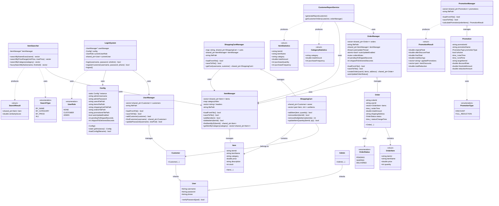

# Shopping System UML Class Diagram

```mermaid
classDiagram
    %% Config Module
    class Config {
        -static Config* instance
        -string adminUsername
        -string adminPassword
        -string usersFilePath
        -string itemsFilePath
        -string shoppingCartFilePath
        -string ordersFilePath
        -string promotionsFilePath
        -bool autoUpdateEnabled
        -int pendingToShippedSeconds
        -int shippedToDeliveredSeconds
        -Config()
        +static getInstance() Config*
        +loadConfig(filename) bool
    }

    %% Item Management Module
    class Item {
        -string itemId
        -string itemName
        -string category
        -double price
        -string description
        -int stock
        +Item(...)
    }

    class ItemManager {
        -vector~shared_ptr~Item~~ items
        -map categoryIndex
        -vector~string~ headers
        -string filePath
        +loadFromFile() bool
        +saveToFile() bool
        +addItem(item) bool
        +deleteItem(itemId) bool
        +findItemByID(itemId) shared_ptr~Item~
        +getItemByCategory(category) vector~shared_ptr~Item~~
    }

    class SearchType {
        <<enumeration>>
        BY_NAME
        BY_CATEGORY
        BY_PRICE
        ALL
    }

    class SearchResult {
        <<struct>>
        +shared_ptr~Item~ item
        +double similarityScore
    }

    class ItemSearcher {
        -ItemManager* itemManager
        +searchByNameExact(name) vector
        +searchByPriceRange(minPrice, maxPrice) vector
        +searchByCategory(category) vector
        +fuzzySearchByName(name, threhold) vector
    }

    %% User Management Module
    class User {
        #string username
        #string password
        #string phone
        +verifyPassword(pwd) bool
    }

    class Customer {
        +Customer(...)
    }

    class Admin {
        +Admin(...)
    }

    class UserManager {
        -vector~shared_ptr~Customer~~ customers
        -string filePath
        +loadFromFile() bool
        +saveToFile() bool
        +addCustomer(customer) bool
        +findCustomer(username) shared_ptr~Customer~
        +updatePassword(username, newPwd) bool
    }

    %% Login Module
    class UserRole {
        <<enumeration>>
        NONE
        CUSTOMER
        ADMIN
    }

    class LoginSystem {
        -UserManager* userManager
        -Config* config
        -UserRole currentUserRole
        -shared_ptr~User~ currentUser
        +login(username, password, isAdmin) bool
        +registerCustomer(username, password, phone) bool
        +logout()
    }

    %% Shopping Cart Module
    class ShoppingCart {
        -shared_ptr~Customer~ owner
        -vector~pair~Item, int~~ cartItems
        +addItem(item, quantity) bool
        +removeItem(itemId) bool
        +removeMultipleItems(itemIds) int
        +updateItemQuantity(itemId, qty) bool
    }

    class ShoppingCartManager {
        -map~string, shared_ptr~ShoppingCart~~ carts
        -shared_ptr~ItemManager~ itemManager
        -string filePath
        +loadFromFile() bool
        +saveToFile() bool
        +getCart(username, customer) shared_ptr~ShoppingCart~
    }

    %% Order Module
    class OrderStatus {
        <<enumeration>>
        PENDING
        SHIPPED
        DELIVERED
    }

    class OrderItem {
        <<struct>>
        +string itemId
        +string itemName
        +double price
        +int quantity
    }

    class Order {
        -string orderId
        -string userId
        -vector~OrderItem~ items
        -time_t orderTime
        -double totalAmount
        -string shippingAddress
        -OrderStatus status
        -time_t statusChangeTime
        +Order(...)
    }

    class OrderManager {
        -vector~shared_ptr~Order~~ orders
        -string filePath
        -shared_ptr~ItemManager~ itemManager
        -thread autoUpdateThread
        -atomic~bool~ autoUpdateEnabled
        -mutex ordersMutex
        -int pendingToShippedSeconds
        -int shippedToDeliveredSeconds
        +loadFromFile() bool
        +saveToFile() bool
        +createOrder(userId, items, address) shared_ptr~Order~
        -autoUpdateOrderStatus()
    }

    %% Promotion Module
    class PromotionType {
        <<enumeration>>
        DISCOUNT
        FULL_REDUCTION
    }

    class Promotion {
        -string promotionId
        -string promotionName
        -PromotionType promotionType
        -bool isActive
        -time_t startTime
        -time_t endTime
        -string targetItemId
        -double discountRate
        -double thresholdAmount
        -double reductionAmount
    }

    class PromotionResult {
        <<struct>>
        +double originalTotal
        +double afterDiscountTotal
        +double finalTotal
        +double totalSavings
        +vector~string~ appliedPromotions
        +vector~pair~ itemDiscounts
        +double totalReduction
    }

    class PromotionManager {
        -vector~shared_ptr~Promotion~~ promotions
        -string filePath
        +loadFromFile() bool
        +saveToFile() bool
        +calculatePromotion(orderItems) PromotionResult
    }
    
    %% Services
    class CategoryStatistics {
        <<struct>>
        +string category
        +double totalAmount
        +int purchaseFrequency
    }

    class ItemStatistics {
        <<struct>>
        +string itemId
        +string itemName
        +string category
        +double totalAmount
        +int purchaseQuantity
        +int purchaseFrequency
    }

    class CustomerReportService {
        +generateReport(customer)
        -getCustomerOrders(customer, orderManager)
    }

    %% Relationships
    ItemManager o-- Item : manages
    ItemSearcher --> ItemManager : uses
    ItemSearcher ..> SearchType : uses
    ItemSearcher ..> SearchResult : produces
    
    Customer --|> User : inherits
    Admin --|> User : inherits
    UserManager o-- Customer : manages
    
    LoginSystem --> UserManager : uses
    LoginSystem --> Config : uses
    LoginSystem ..> UserRole : uses
    
    ShoppingCart --> Customer : belongs to
    ShoppingCart --> Item : contains
    ShoppingCartManager o-- ShoppingCart : manages
    ShoppingCartManager --> ItemManager : uses
    
    Order --> OrderItem : contains
    Order ..> OrderStatus : uses
    OrderManager o-- Order : manages
    OrderManager --> ItemManager : uses
    
    Promotion ..> PromotionType : uses
    PromotionManager o-- Promotion : manages
    PromotionManager ..> PromotionResult : produces
    
    CustomerReportService --> OrderManager : uses
    CustomerReportService --> ItemManager : uses
    CustomerReportService ..> CategoryStatistics : produces
    CustomerReportService ..> ItemStatistics : produces
```
